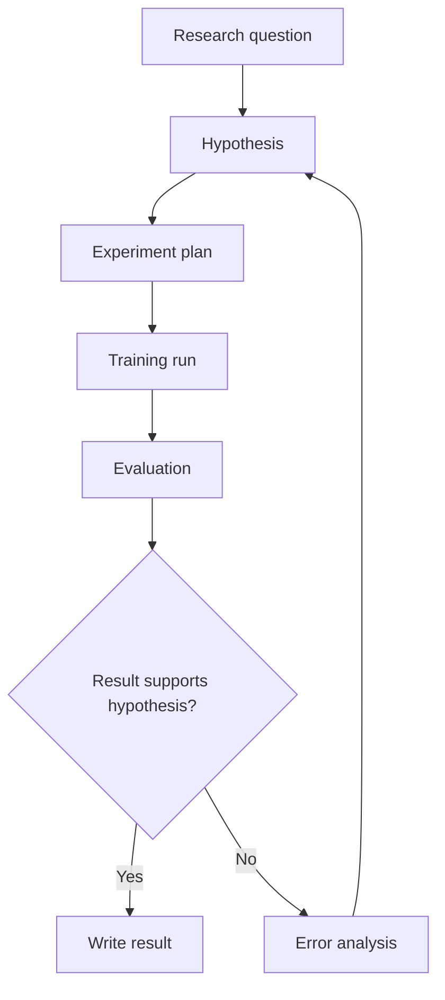

---
aliases:
  - mermaid
---
# Mermaid

Mermaid is useful for lightweight diagrams in research notes, especially model pipelines, experiment workflows, and project timelines.

## Example

Documentation: <https://mermaid.js.org/>

---
#concept
